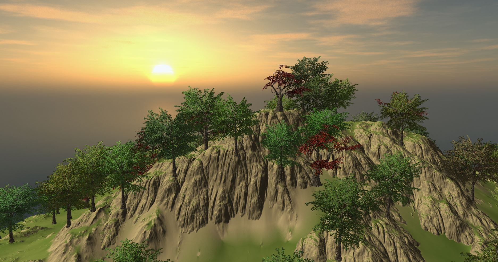
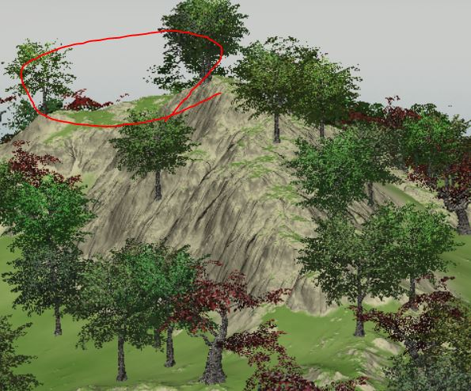
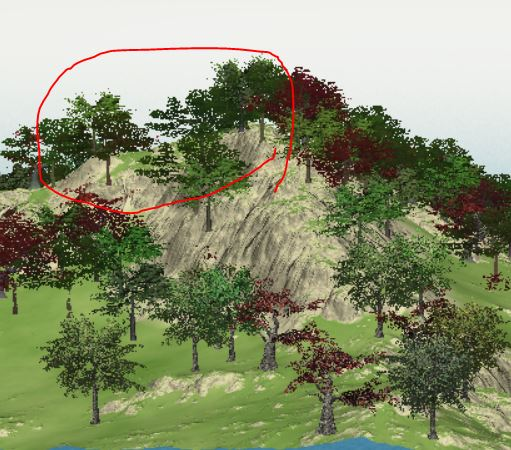
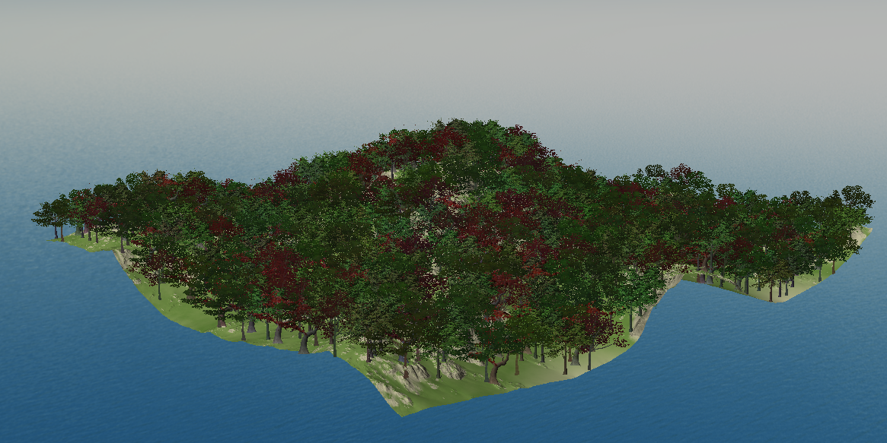
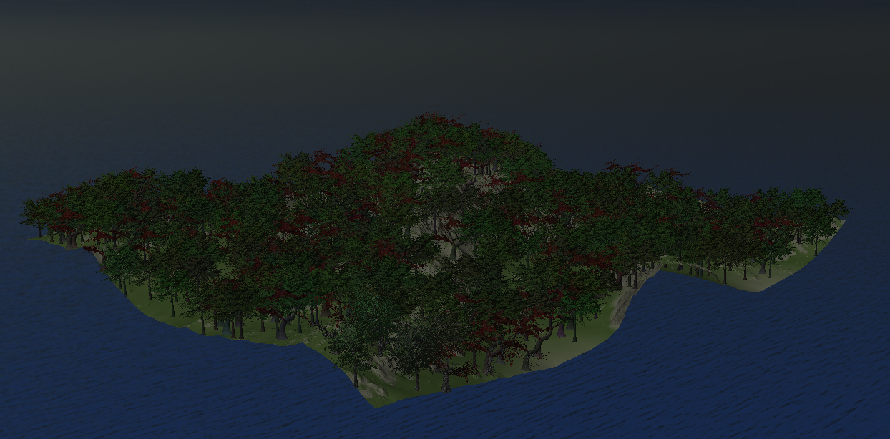
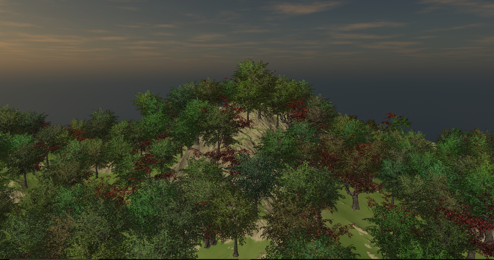
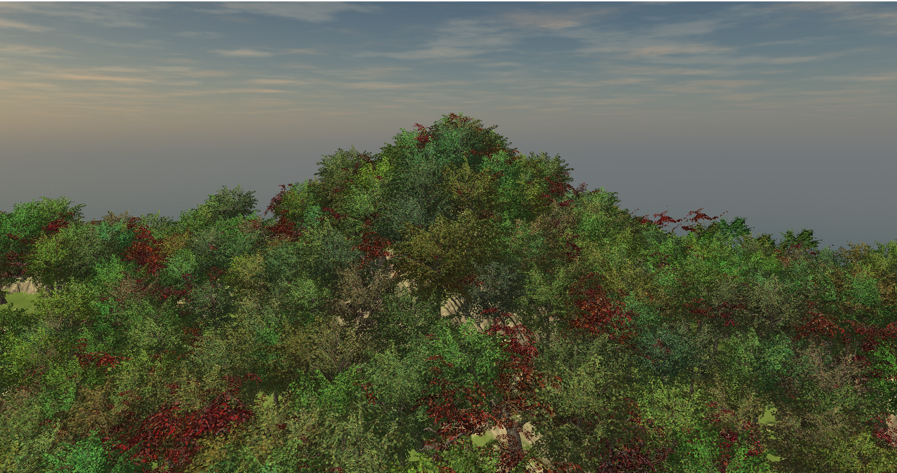
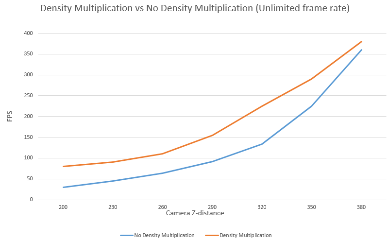

# Vulkan-Forest-Rendering-Engine
* Jiawei Wang, Yi Guo
* University of Pennsylvania, CGGT
* 2017.11.25 - 2017.12.11
___
## Overview
* The project is a high-performance **Real-time** forest rendering engine developed using Vulkan. We optimized the performance both for CPU part and GPU part. 
* It contains **multiple LOD strategy** rendering(realized by compute shader in Vulkan), **nature Wind-zone** of forest(realized by vertex animation for each tree), **Density Multiplication Effect**('fake trees'), **Day&Night Cycle**, etc. 
* The users can also use the GUI to modify the parameters to get the disired result effect they want in the demo.

|**Final Rendering**|
|---|
||

___
## Features
### WindZone
* We generate different Wind Force for different trees in the forest according to their horizontal positions, which can simulate a realistic wind effect for a large scale zone.
* Besides, for each tree, we simulate their waving animation using the algorithm presented in [Gem3 Chapter 16]
* Example Gif

### Multiple LOD Strategy
* In computer graphics, accounting for Level of detail involves decreasing the complexity of a 3D model representation as it moves away from the viewer or according to other metrics such as object importance, viewpoint-relative speed or position. Level of detail techniques increase the efficiency of rendering by decreasing the workload on graphics pipeline stages, usually vertex transformations. The reduced visual quality of the model is often unnoticed because of the small effect on object appearance when distant or moving fast. [Wiki]
* Here we are using only 2 levels of detail just for example:
    * LOD 0: Full Model
    * LOD 1: Billboard
  When the object is close, we will render its full model, otherwise, billboard.
* The visual effect can be realized by using `discard` in fragment shader according to the object position and viewer position.
* Example Gifs

### LOD & Frustum Culling using Compute Shader
* As we presented before, we can realize the visual effect using only fragment shader, but for those models/billboards which will not show on the screen, we still need to run their vertex shader.
* So, what we disired is to only render what could be on the screen, and we can realize it by culling them before we start render.
* Example Gifs

### Morphing
* We know that we will choose what to render according to the distance, but in the border of different LOD, even though they are similar, you can still easily find out that there is a strange shift like following example.
* To fix that, we implement a smooth morphing process to make this shifting more natrual.(Realized using a noise map and an overlapping area for different LODs)
* Example Gifs
* There are many methods to do the Frustum Culling, for example, using 6 planes of the camera and do the "Whether intersect" test for the objects' bounding boxes. Here I use another method, instead of computing the planes info on GPU each frame, I choose to compute 6 NDC coordinates for each object in the shader, because of the symmetric structure for trees(6 points: Up, Bottom, Left, Right, Front, Back), and then check if they are inside of NDC space.

### Density Multiplication
* In real game, we always want players to have a feeling like "Wow, that moutain is full of trees", but we also want that when players are actually in the forest, they will have enough space to walk and interact, whic means "Several Trees closely, Lots of Trees distantly".
* This effect can be generated using "Fake Trees", which are also billboards but not the billboards for the real model, they will disappear when the players are close enough, and appear again when players are distant enough. Also, because they are far from the players, who are focus on the nearby things, most of them couldn't even be realized. 
* For more specific algorithm to generate them, you can look into the code in 'Scene.cpp'
* Example Gifs

|**Density Multiplication**|
|---|
||

|**Close**|**Distant**|
|---|---|
|||

### Day & Night Cycle
* We blend the skybox and change the light Color and intensity according to the time.
* Example Gifs

|**Day & Night (10s)**|
|---|
||

___
## Performance Analysis

### Compute Shader Culling vs No Culling
To improve the rendering efficiency, we implement the compute shader culling to filter out the trees that we don't need to render for the current frame and render them as billboard or directly ignore them. We implement 2 kinds of culling, frustrum culling and distance culling. Here is the performance analysis.

#### Distance LOD culling 
Distance culling can improve the overall efficiency when the camera is far away from the forest(God view). It will filter out the trees that are far away from the camera.

Distance Culling can bring benefits on both memory and rendering speed. For memory benefits, only the trees that is very near to the camera will be rendered as actual tree models( 4000+ vertices each) and the trees that is far away will be rendered as billboard(4 vertices each). We make a simple table to show the benefits 

And here is the overall rendering efficiency plot

### Density Multiplication vs No DM
Density multiplication is used to provide better view effect of the forest. Different from LOD, the density multiplication works on the density of trees instead of the detail of the tree model. The technique produce multiple fake trees around each actual tree model when the camera is far away, and delete those fake tree and only shows actual tree models when the camera is near to the forest. When camera is far away from the forest, you can see a great forest coverage.When you actually walk into the forest, the number of actual tree models is not that many but it is not easy to identify.
Here are the effects of Density Multiplication. The memory cost is somehow similar with the memory discussion in *Distance LOD culling* part and here we will only compare the fps.

|**DM**|**No DM**|
|---|---|
|||
|---|---|
|||

As the plot and picture shows, when the camera is far away from the forest, there is no great visual and efficiency difference between using and not using DM, but when the camera get closer to forest, DM will show its benefits, because the less trees need to be rendered.

## Credits
* [Vulkan examples](https://github.com/SaschaWillems/Vulkan) by [SaschaWillems](https://github.com/SaschaWillems)
* [Imgui](https://github.com/ocornut/imgui)
