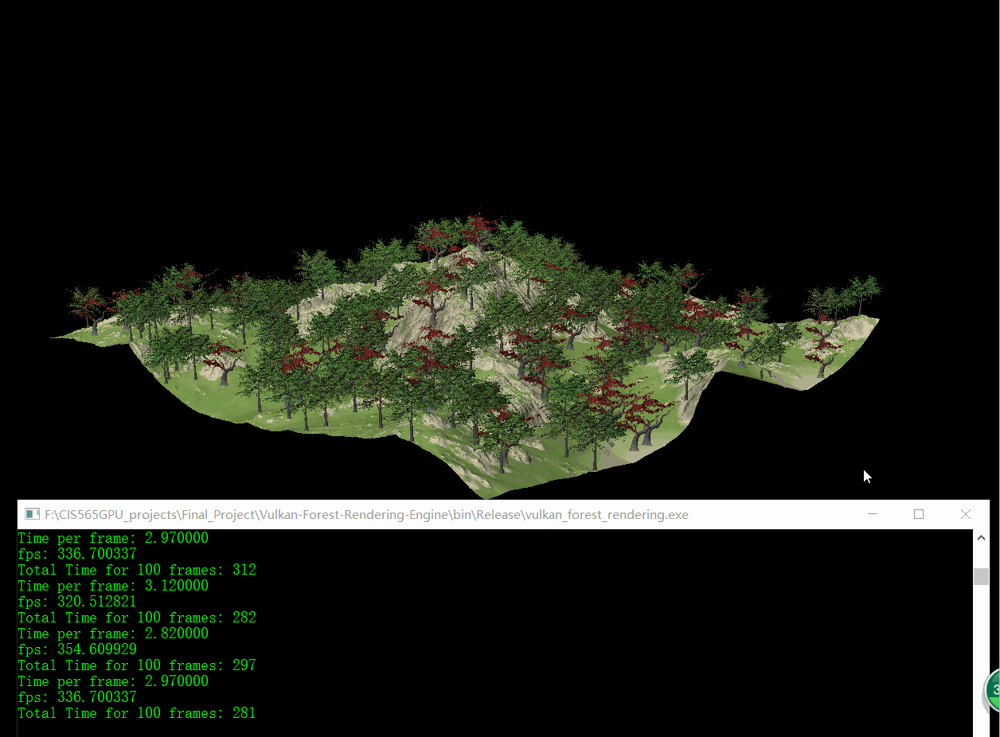
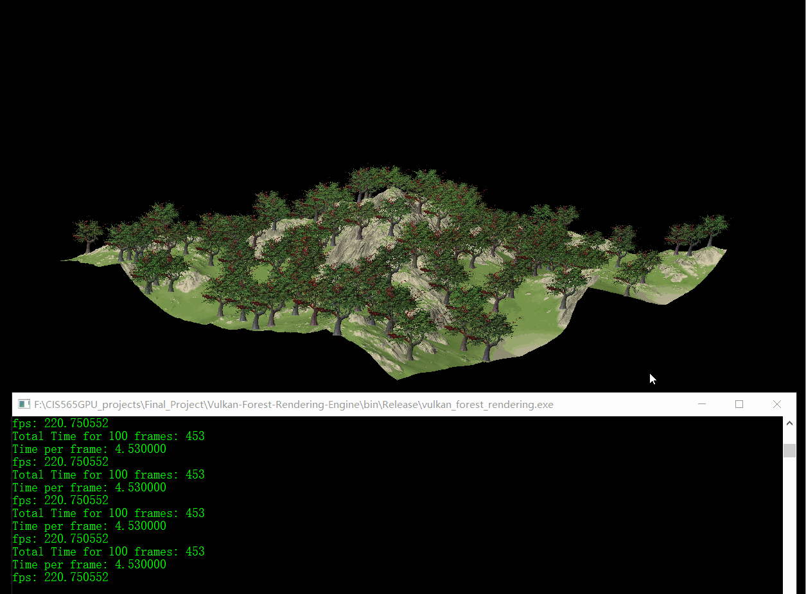
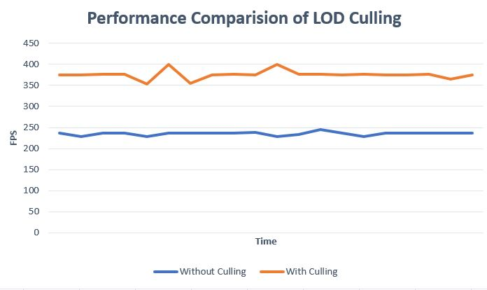

# Vulkan-Forest-Rendering-Engine
* Jiawei Wang, Yi Guo
* University of Pennsylvania, CGGT

___
## Milestone 1 (11/20/2017)
* **Better Camera Control**
* **Implement the FBX importer**
* **Implement rendering pipeline and shaders for trees (trunk and leaves, billboard)**
* **Vertex Coloring for vertex animation**
* **Add vertex animation**
* **Fading Effect**
* **Basic LOD(Still Debugging)**

___
## Milestone 2 (11/27/2017)
* **Terrain Building**
* **Terrain Loading**
* **Hardware Instancing**
* **Billboard Rotating**
* **Variability of Trees**
* **Basic LOD**
* **Skybox(Still Debugging)**

|**Trees Rendering**|
|---|
||

|**Single Tree**|
|---|
||

___
## Milestone 3 (12/04/2017)
* **Frustum culling and distance culling using Compute Shader**
* **Optimize code structure to enable multiple Model Loading**
* **Replace the hardcode parameters with Uniform descriptors**
* **Cubemap**
  -   Pipeline built and works well
  -   Still debugging the multi-layers image texture)
* **Gui** 
  -  imgui library used
  -  works but haven’t merged
  
### Results
* **LOD Culling**: 
  * LOD0: 0 ~ **0.5** x (far_clip - near_clip)
  * LOD1: **0.3** ~ **1.0** x (far_clip - near_clip)
  * Overlapping area for the morphing

|**Billbaord Culling**|**Model Culling**|
|---|---|
|||

|**With Culling**|**Without Culling**|
|---|---|
|||

|**Performance Comparision of LOD Culling(270 Trees and 270 Billboards)**|
|---|
||

* **Morphing**:

|**With Morphing**|**Without Morphing**|
|---|---|
|||

* **Demo**

## For next week 
* **Density multiplication**
* **Optimize the Architecture** 
* **GUI & Cubemap bugs fixed** 
* **Shadow map( Depends on time)** 
* **Performance analysis**
  -   Memory occupancy
  -   Fps

